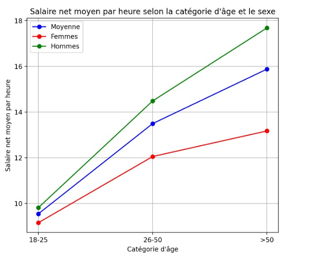

# Data Analyst

### Compétences : 
#### Certifications : 
Python, SQL, Power BI, Machine Learning, Text Mining, Web Scraping
#### Outils : 
Google Analytics, Streamlit, GitHub, Excel, Canva, Wordpress, Yoast, Search Console (SEO), MetaBusiness, Brevo

### Projets :
- Codage en Python d’une application de **Machine Learning** prédisant le salaire moyen selon des variables socio-économiques avec une fiabilité de 93% (r2) et une erreur moyenne de prédiction (MAE) de 0.4 (pour une variable cible oscillant entre 10 et 50, déployée sur **Streamlit** via **GitHub**. L'application est basée sur des jeux de données de l'Insee (au total plus de 8 millions d'entrée sur la population française) intégralement nettoyés et processés afin de permettre la mise en oeuvre d'un modèle de régression linéaire (Linear Regression). L'application mise en ligne permet un test du modèle de prédiction et présente les différentes étapes ayant abouti au modèle final (Data Visualization à l'aide d'outils tels que **Plotly**, **Seaborn** etc ; essais de différents modèles de Machine Learning et analyse des résultats, ...)
 ***<a href="https://france-salaires.streamlit.app/" target="_blank">Consulter l'application france-salaires.streamlit.app</a>***

- Rédaction d’un rapport d’analyse et de visualisation de données sur les inégalités salariales en France, sur base du jeu de données de l'Insee (plus de 8 millions d'entrées) nettoyé et traité. Explication de chaque étape du projet, analyse des variables explicatives influençant le salaire moyen, visualisation par des graphiques, figures, tests statistiques, détail de la mise en oeuvre du machine learning sur notre problématique, analyse des Features importance et conclusion.
 ***<a href="https://louis-marechal.github.io/French_industry.pdf" target="_blank">Consulter le rapport French Industry - Analyse comparative des données sur les salaires en France selon les déterminants géographiques et socio-économiques</a>***
 Notre projet a permis d'identifier les principales variables influençant le salaire moyen, et de vérifier la nature des corrélations par le machine learning. Parmi nos observations, nous avons établi une correspondance quasi-parfaite de la carte du salaire moyen avec celle de la densité de population.

Parmi les autres variables identifiées, on peut citer : 
 le sexe : le salaire moyen est plus élevé chez les hommes que chez les femmes
 le nombre d'entreprises implantées : plus le nombre est élevé, plus faible est le salaire
 la taille des entreprises : les plus grosses entreprises tendent à offrir un salaire plus élevé
 l'âge : le salaire évolue avec l'âge et les inégalités ont tendance à s'accentuer avec l'âge

Nos observations permettent de dresser un portrait général des inégalités en France, afin d'orienter la recherche, ou de cibler d'éventuelles politiques publiques sur certaines catégories de la population. Enfin, elles peuvent également s'avérer utile dans le cadre d'études de marché pour des entreprises souhaitant s'implanter dans un territoire, en offrant une clé d'analyse sur certains indicateurs pouvant influencer à la hausse ou à la baisse le salaire.

- Réalisation d’un Dashboard et d’un rapport d’activité sur **PowerBI** sur base de données réelles anonymisées (environ 100.000 entrées) d'une entreprise de type Call center qui vend des produits marketing. Mise en place d'un modèle en étoile permettant une analyse approfondie, visuelle et interactive d'indicatifs financiers et de KPI, ainsi que la création de métriques de performance.
 Note : le fichier ci-dessous est un export PDF mais le fichier .pbix permet d'afficher la version interactive du rapport dans Power BI.
 ***<a href="https://louis-marechal.github.io/BusinessReport-PowerBI.pdf" target="_blank">Voir le rapport PDF</a>***
 ***[Télécharger le fichier .pbix du rapport](https://louis-marechal.github.io/BusinessReport.pbix)***

### Formation
Mines bla bla bla

### Work experience
Editor in chief

### Exemple de téléchargement
[Télécharger mon rapport PDF complet](https://louis-marechal.github.io/BusinessReport.pbix)
