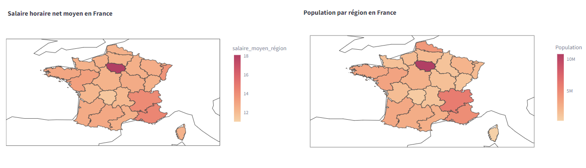

# Data Analyst

## 🛠️ Compétences : 
#### <a href="https://www.linkedin.com/in/marechal-louis/details/certifications/" target="_blank">🎓 Certifications</a> Mines-Paris PSL / DataScientest : Python, SQL, Power BI, Tableau, Google Looker Studio, Machine Learning, Scikit-learn, Pandas, Numpy, Seaborn, SciPy, Matplotlib, DAX, Power Query, BeautifulSoup (Web Scraping), Text Mining
🛠️ Outils : Tableau, BigQuery, Google Analytics, Streamlit, GitHub, Plotly, PowerApps, Power Automate, Copilot, Excel, Canva, Wordpress, Google Tag Manager, Yoast, Search Console (SEO), MetaBusiness, Brevo

## 📌 Projets :
### 👨‍💻 Prédiction du salaire moyen (app) 
<a href="https://france-salaires.streamlit.app/" target="_blank">Consulter l'application france-salaires.streamlit.app</a>  
 Codage en **Python** et création d’une application prédisant le salaire net moyen selon des variables socio-économiques (comme la catégorie socio-professionnelle, la ville, l'âge, le sexe, la densité de population dans la zone de l'entreprise, le nombre d'entreprises implantées, leur taille etc) afin d'aider une entreprise à optimiser son offre salariale. Collecte et création / structuration des jeux de données : nettoyage, preprocessing avec Python (principalement **Pandas**), mise en oeuvre d'un modèle prédictif de **Machine Learning** (régression linéaire) avec **Scikit-learn** - précision de 93% (r2). Déployée sur **Streamlit** via **GitHub**, l'application propose une démo du modèle de prédiction et présente les principales étapes du projet, ainsi qu'une Data Visualization à l'aide d'outils tels que **Plotly** ou **Seaborn**. Projet validé par jury dans le cadre de ma formation DataScientest certifiée Mines Paris-PSL.

*Source des données : 4 datasets non-structurés de l'Insee sur la population française, 8 millions d’entrées X 61 variables; que j'ai entièrement préparés, nettoyés, préprocessés, restructurés etc*

  

### 📊 Business Dashboard / Rapport Power BI
<a href="https://louis-marechal.github.io/BusinessReport-PowerBI.pdf" target="_blank">Consulter le rapport au format PDF</a>
 
 Exemple d'un rapport interactif de performance à destination de la direction régionale d'un call center. Création de rapports de visualisation de données sur **PowerBI** sur base de données brutes que j'ai entièrement préparées et traitées avec **SQL** et **PowerQuery** (sélection des données, élimination des doublons, gestions valeurs nulles, restructuration etc). Création de métriques de performance dans le logiciel, mise en place d'un modèle en étoile permettant une analyse approfondie et interactive d'indicatifs financiers et de KPI tels que : performance par date, par manager, par employé, par bureau, secteur etc. NB : le fichier ci-dessus est un export PDF mais le fichier .pbix disponible <a href="https://louis-marechal.github.io/BusinessReport.pbix" target="_blank" download>ici</a> permet d'afficher la version interactive du rapport dans Power BI.

*Source des données : données non-structurées réelles anonymisées d'une entreprise de type Call center vendant des produits marketing, 6 datasets, 100 000 entrées X 32 variables*

  

### 📑 Rapport d'analyse comparative de données sur les salaires

<a href="https://louis-marechal.github.io/French_industry.pdf" target="_blank">Consulter le rapport French Industry - Analyse comparative des données sur les salaires en France selon les déterminants géographiques et socio-économiques</a>
 
 Projet validant la formation DataScientest certifiée Mines-PSL (300 heures), visant à identifier la distribution catégorielle des salaires en France et à définir les variables impactant le salaire moyen. Préparation, nettoyage et traitement de données (élimination des doublons, gestion valeurs nulles et aberrantes, restructuration par élimination et création de colonnes, numérisation et standardisation des valeurs etc) en utilisant **Python**, **Pandas** et **Numpy**, visualisation de données avec **Matplotlib** et **Seaborn**, création de cartes géographiques de données avec **Plotly**, instanciation de modèles de **Machine Learning** avec **Scikit-learn**, représentation graphique des résultats et analyse des feature importance, réalisation de tests statistiques. Une corrélation a été établie et confirmée par un modèle de régression linéaire (r2 de 93%) entre le salaire moyen et, entre autres : le sexe, l'âge, le nombre d'entreprises implantées dans un territoire, leur taille. En outre, une correspondance quasi-parfaite a été établie entre la cartographie du salaire moyen et celle de la densité de population, les deux variables semblant suivre la même distribution géographique. Ces observations peuvent par exemple être utilisées pour catégoriser la population dans le cadre de politiques publiques ayant trait aux inégalités salariales, etc.

*Source des données : 4 datasets non-structurés de l'Insee sur la population française, 8 millions d’entrées X 61 variables*

## 🎓 Formation
**Mines Paris - PSL / DataScientest | RNCP Data Analyst (_2024_)**
 300 heures dont 80 heures de projet :
- *Programmation **Python***
- *Data Visualization : **Plotly, Matplotlib, Seaborn***
- *Machine Learning : **Scikit-learn***
- *Analyse de données : Big Data*
- *Extraction de données : Text Mining, WebScraping*
- *Business Intelligence : **Power BI***
- *Big Data : **SQL***
 

**Senza, Formation Webmarketing, SEO, Social Media (_2024_)**

**Université de Louvain, BAC+5 Sciences politiques (_2015_)**			        		

**Université de Namur, BAC+3 Anglais / Néerlandais (_2012_)**

## 💼 Expérience professionnelle

**Digital Analyst @ Freelance (_2023-2024_)**
Rapports d'audit, benchmarking, suivi de KPI spécifiques aux besoins métiers et formulation de recommandations

**Rédacteur en chef digital / Data Analyst @ RT France (_2020-2023_)**
- *Management de 20 journalistes*
- *Définition de KPIs selon objectifs*
- *Collecte et structuration de la Data (avec Power BI, SQL, Python) depuis Google Analytics, Facebook, YouTube...*
- *Visualisation par tableaux de bord pour identifier les leviers de conversion*
- *Reporting/Communication des résultats (équipes direction, marketing...) et formulation de recommandations stratégiques*
- ***Résultats***
 92% croissance YouTube (en nombre d'abonnés entre 2020 et 2023, passant de 600k à 1,15 millions ; doublement du CPM
 Amélioration ROAS et taux de conversion

**Chef d'édition web, Rédacteur @ RT France (_2015-2020_)**

## A propos de moi

💼 Doté de 7 ans d’expérience professionnelle dans les médias, je me suis tourné vers la Data en 2020 quand, en tant que rédacteur en chef digital d'un média international, j'ai privilégié une approche basée sur l’analyse des données dans un objectif d'acquisition d'audience digitale. Ma méthode (collecter la Data sur mesure; identifier les KPIs; nettoyer et structurer / modéliser la donnée; visualiser et reporter par le biais de dashboards adaptés) a généré des résultats probants pour l'entreprise, dont :
📊 2 millions de visiteurs uniques / mois
📈 Augmentation de 92% du nombre d'abonnés YouTube entre 2020 et 2023, pour atteindre 1,15 millions, doublement du CPM, amélioration du ROAS et du taux de conversion.

🔍 En 2024, j'ai fait certifier mes compétences techniques grâce à un diplôme de Data Analyst de l’Ecole des Mines Paris - PSL, dont entre autres :
Python, SQL, Power BI, Machine Learning, Scikit-learn, Pandas, Numpy, Seaborn, SciPy, Matplotlib, BeautifulSoup (Web Scraping), Text Mining.

🧑‍🤝‍🧑 Mon expérience de management d'une rédaction digitale de 20 journalistes me donne en outre une excellente capacité de rédaction et de communication à tous les niveaux de l'entreprise : une qualité sine qua non pour tout Data Analyst qui se respecte !

🚀 En quête d’un nouveau challenge, je m’adapte facilement à tous secteurs d’activité. N'hésitez pas à me contacter pour tout projet professionnel !

## Contact

✉️ Mail : [marechal-louis@hotmail.com](mailto:marechal-louis@hotmail.com)

***<a href="https://louis-marechal.github.io/CV Louis Marechal Data Analyst.pdf" target="_blank" download>Télécharger mon CV</a>***

