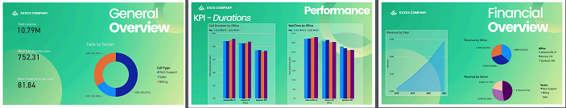
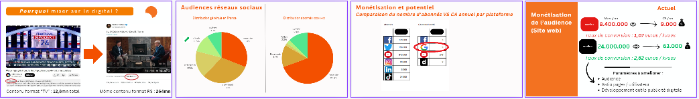

# Data Analyst

## Compétences : 
#### <a href="https://www.linkedin.com/in/marechal-louis/details/certifications/" target="_blank">🎓 Certifications</a> Mines-Paris PSL / DataScientest : Python, SQL, Power BI, Machine Learning, Scikit-learn, Pandas, Numpy, Seaborn, SciPy, Matplotlib, BeautifulSoup (Web Scraping), Text Mining
🛠️ Outils : Google Analytics, Streamlit, GitHub, Plotly, Excel, Canva, Wordpress, Yoast, Search Console (SEO), MetaBusiness, Brevo

## 📌 Projets :
### 👨‍💻 Prédiction du salaire moyen (app) 
<a href="https://france-salaires.streamlit.app/" target="_blank">Consulter l'application france-salaires.streamlit.app</a>  
 Codage en **Python** et création d’une application prédisant le salaire net moyen selon des variables socio-économiques (comme la catégorie socio-professionnelle, la ville, l'âge, le sexe, la densité de population dans la zone de l'entreprise, le nombre d'entreprises implantées, leur taille etc). Après nettoyage et preprocessing des datasets avec Python (principalement **Pandas**), mise en oeuvre d'un modèle prédictif de **Machine Learning** (régression linéaire) avec **Scikit-learn** - précision de 93% (r2). Déployée sur **Streamlit** via **GitHub**, l'application propose une démo du modèle de prédiction et présente les principales étapes du projet, ainsi qu'une Data Visualization à l'aide d'outils tels que **Plotly** ou **Seaborn**. Projet validé par jury dans le cadre de ma formation DataScientest certifiée Mines Paris-PSL. Le modèle peut être utilisé par une entreprise pour optimiser son offre salariale, ou dans le cadre de politiques ciblées.  

*Source des données : 4 datasets de l'Insee sur la population française, 8 millions d’entrées X 61 variables*

  

### 📊 Business Dashboard / Rapport Power BI
<a href="https://louis-marechal.github.io/BusinessReport-PowerBI.pdf" target="_blank">Consulter le rapport au format PDF</a>
 
 Création de rapports de visualisation de données sur **PowerBI**. Création de métriques de performance dans le logiciel, mise en place d'un modèle en étoile permettant une analyse approfondie et interactive d'indicatifs financiers et de KPI tels que : performance par date, par manager, par employé, par bureau, secteur etc. NB : le fichier ci-dessus est un export PDF mais le fichier .pbix disponible <a href="https://louis-marechal.github.io/BusinessReport.pbix" target="_blank" download>ici</a> permet d'afficher la version interactive du rapport dans Power BI.

*Source des données : données réelles anonymisées d'une entreprise de type Call center vendant des produits marketing, 6 datasets, 100 000 entrées X 32 variables*

  

### 📑 Rapport d'analyse comparative de donnés sur les salaires

<a href="https://louis-marechal.github.io/French_industry.pdf" target="_blank">Consulter le rapport French Industry - Analyse comparative des données sur les salaires en France selon les déterminants géographiques et socio-économiques</a>
 
 Projet validant la formation DataScientest certifiée Mines-PSL (300 heures), visant à identifier la distribution catégorielle des salaires en France et à définir les variables impactant le salaire moyen. Nettoyage et traitement de données en utilisant **Python**, **Pandas** et **Numpy**, visualisation de données avec **Matplotlib** et **Seaborn**, création de cartes géographiques de données avec **Plotly**, instanciation de modèles de **Machine Learning** avec **Scikit-learn**, représentation graphique des résultats et analyse des feature importance, réalisation de tests statistiques. Une corrélation a été établie et confirmée par un modèle de régression linéaire (r2 de 93%) entre le salaire moyen et, entre autres : le sexe, l'âge, le nombre d'entreprises implantées dans un territoire, leur taille. En outre, une correspondance quasi-parfaite a été établie entre la cartographie du salaire moyen et celle de la densité de population, les deux variables semblant suivre la même distribution géographique. Ces observations peuvent par exemple être utilisées pour catégoriser la population dans le cadre de politiques publiques ayant trait aux inégalités salariales, etc.

*Source des données : 4 datasets de l'Insee sur la population française, 8 millions d’entrées X 61 variables*

### 📈 Audit / Benchmark
<a href="https://louis-marechal.github.io/Audit digital media.pdf" target="_blank">Consulter le rapport anonymisé d'audit - stratégie digitale media</a>
 
 Extrait anonymisé d'un rapport d'analyse de données réalisé pour une entreprise de médias, fournissant des insights sur la meilleure stratégie digitale à adopter pour optimiser les résultats en termes financiers. Audit des performances, benchmark concurrentiel et fixation d'objectifs.

*Source des données : données fournies par l'entreprise cliente*

  

## 🎓 Formation
**Mines Paris - PSL / DataScientest | RNCP Data Analyst (_2024_)**
 300 heures dont 80 heures de projet :
- *Programmation **Python***
- *Data Visualization : **Plotly, Matplotlib, Seaborn***
- *Machine Learning : **Scikit-learn***
- *Analyse de données : Big Data*
- *Extraction de données : Text Mining, WebScraping*
- *Business Intelligence : **Power BI***
- *Big Data : **SQL***
 

**Senza, Formation Webmarketing, SEO, Social Media (_2023_)**

**Université de Louvain, BAC+5 Sciences politiques (_2015_)**			        		

**Université de Namur, BAC+3 Anglais / Néerlandais (_2012_)**

## 💼 Expérience professionnelle

**Audits, benchmark media (_2023-2024_)**

**Rédacteur en chef digital @ RT France (_2020-2023_)**
- *Management de 20 journalistes*
- *Orientation prise de décision stratégique par la data (real-time et analyses quotidiennes via Google Analytics), fixation KPI, reporting / communication des résultats*
- ***Résultats***
 2 millions/mois utilisateurs uniques site web en moyenne
 1,15 million abonnés YouTube (+ 92% entre 2020 et 2023)

**Chef d'édition web, Rédacteur @ RT France (_2015-2020_)**

## A propos de moi

💼 Doté de 7 ans d’expérience professionnelle dans les médias, je me suis tourné vers la Data en 2020 quand, en tant que rédacteur en chef digital d'un média international, j'ai privilégié une approche basée sur l’analyse des données (via Google Analytics), avec des résultats probants pour l'entreprise :
📊 2 millions de visiteurs uniques / mois
📈 Augmentation de 92% du nombre d'abonnés YouTube entre 2020 et 2023, pour atteindre 1,15 millions

🔍 Cherchant à approfondir ma technique, j'ai entrepris en 2024 une reconversion comme Data Analyst par une formation DataScientest de 300 heures, dont 80 heures de projet, certifiée par l’Ecole des Mines Paris - PSL. Celle-ci m'a permis d'acquérir des certifications pour les compétences techniques suivantes :
Python, SQL, Power BI, Machine Learning, Scikit-learn, Pandas, Numpy, Seaborn, SciPy, Matplotlib, BeautifulSoup (Web Scraping), Text Mining.

📌 Dans le cadre de ma formation et en dehors, j'ai travaillé sur plusieurs projets de Data Analyse détaillés ci-dessus.

🧑‍🤝‍🧑 Mon expérience de management d'une rédaction digitale de 20 journalistes me donne en outre une excellente capacité de rédaction et de communication à tous les niveaux de l'entreprise.

🚀 En quête d’un nouveau challenge, je m’adapte facilement à tous secteurs d’activité. N'hésitez pas à me contacter pour tout projet professionnel !

## Contact

✉️ Mail : [marechal-louis@hotmail.com](mailto:marechal-louis@hotmail.com)
<a href="https://louis-marechal.github.io/CV Data Analyst - Louis Marechal.pdf" target="_blank" download>Télécharger mon CV</a>

